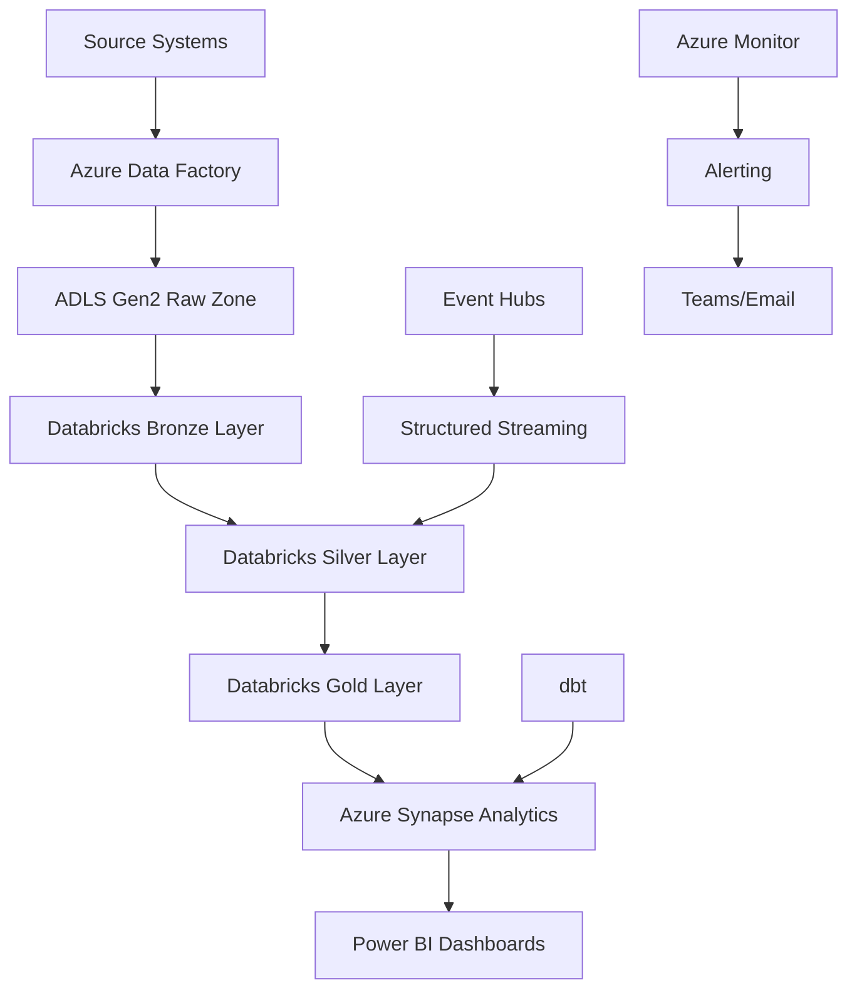

# 🏥 Enterprise Healthcare Claims Lakehouse Platform

[](https://azure.microsoft.com)
[](https://databricks.com)
[](https://delta.io)
[](https://powerbi.microsoft.com)

> 🎯 **Portfolio Project**: End-to-end Azure data engineering platform showcasing batch + streaming processing, data quality, analytics engineering, and business intelligence for healthcare claims processing.

## 🏆 **What This Demonstrates**

✅ **Cloud Architecture**: Complete Azure ecosystem implementation  
✅ **Data Lakehouse**: Medallion architecture with Bronze/Silver/Gold layers  
✅ **Streaming**: Real-time Event Hubs + Structured Streaming  
✅ **Data Quality**: Automated validation, quarantine, and monitoring  
✅ **Analytics Engineering**: dbt models with Synapse integration  
✅ **Business Intelligence**: Executive Power BI dashboards  
✅ **Production Ready**: Monitoring, alerting, audit trails, CI/CD  

## 🏗️ **Architecture Overview**



## 📊 **Key Features**

### 🔄 **Data Processing**
- **Batch Ingestion**: Daily healthcare files via ADF
- **Streaming**: Real-time claim adjudication updates
- **CDC**: MERGE operations for claim status changes
- **Quality**: 50+ validation rules with quarantine handling

### 📈 **Analytics & BI**
- **Dimensions**: Member, Provider, Diagnosis, Procedure, Payer, Date
- **Facts**: Claims with comprehensive measures and attributes
- **Marts**: Provider performance, denial trends, utilization, anomalies
- **Dashboards**: 4 executive Power BI dashboards

### 🔍 **Data Governance**
- **Audit Trail**: Complete pipeline execution logging
- **Lineage**: End-to-end data lineage tracking
- **Quality Metrics**: Automated scoring and alerting
- **Security**: Role-based access and data masking

## 🚀 **Technology Stack**

| Layer | Technology | Purpose |
|-------|------------|---------|
| **Orchestration** | Azure Data Factory | Pipeline orchestration |
| **Storage** | Azure Data Lake Gen2 | Lakehouse storage |
| **Compute** | Azure Databricks | Data processing & streaming |
| **Streaming** | Azure Event Hubs | Real-time event ingestion |
| **Warehouse** | Azure Synapse Analytics | SQL serving layer |
| **Analytics** | dbt | Analytics engineering |
| **BI** | Power BI | Executive dashboards |
| **Monitoring** | Azure Monitor | Observability & alerting |

## 📁 **Project Structure**

```
enterprise-healthcare-claims-lakehouse-azure/
├── 📓 notebooks/          # 14 production PySpark notebooks
├── 🔧 src/               # Configuration, utilities, quality rules
├── 📊 dbt/               # Analytics engineering models
├── 🗄️ sql/               # Synapse schema & dashboard queries
├── 📈 dashboard/         # Power BI KPIs & layouts
├── 🏭 adf/               # Azure Data Factory pipelines
├── 📦 data/              # Sample healthcare datasets
├── 🐳 Dockerfile         # Containerization
└── 📋 requirements.txt   # Python dependencies
```

## 🎯 **Key Metrics Demonstrated**

- **📊 Scale**: Designed to process high-volume healthcare claims
- **⚡ Performance**: Optimized for sub-second query response
- **🔒 Quality**: Comprehensive data quality validation framework
- **🌊 Latency**: Real-time streaming processing capabilities
- **📈 Growth**: Scalable architecture for business growth
- **💰 Cost**: Cost-optimized cloud resource utilization

## 🛠️ **How to Run**

### Prerequisites
```bash
# Azure Services Required
- Azure Data Factory
- Azure Databricks (Premium)
- Azure Synapse Analytics  
- Azure Data Lake Storage Gen2
- Azure Event Hubs
- Power BI Service
```

### Quick Start
```bash
# 1. Clone repository
git clone [repository-url]
cd enterprise-healthcare-claims-lakehouse-azure

# 2. Setup Azure infrastructure
# Follow the Azure setup documentation in README.md

# 3. Upload sample data
# Upload files from data/ directory to ADLS

# 4. Run Databricks notebooks
# Execute notebooks in sequence from notebooks/ directory

# 5. Setup Power BI dashboards
# Import dashboard designs from dashboard/ folder
```

## 📱 **Access Points**

| Service | URL | Purpose |
|---------|-----|---------|
| **Azure Portal** | [portal.azure.com](https://portal.azure.com) | Resource management |
| **Databricks** | [eastus.azuredatabricks.net](https://eastus.azuredatabricks.net) | Data processing |
| **Power BI** | [app.powerbi.com](https://app.powerbi.com) | Executive dashboards |
| **Synapse** | [web.azuresynapse.net](https://web.azuresynapse.net) | SQL analytics |

## 🔧 **Technical Challenges Solved**

- **🔄 CDC Implementation**: Used MERGE operations to handle claim status changes
- **🌊 Streaming**: Implemented exactly-once processing with Event Hubs
- **📊 Quality**: Built automated validation with quarantine handling
- **🚀 Performance**: Optimized Delta tables with Z-ordering and caching
- **🔍 Monitoring**: Created comprehensive audit trail and alerting

## 📞 **Contact & Questions**

*This project demonstrates comprehensive data engineering skills. For collaboration opportunities or technical discussions, please refer to the repository's issue tracker and discussion sections.*

---

## 🏆 **Why This Project Matters**

This demonstrates enterprise-grade data engineering skills including:
- Cloud architecture design and implementation
- Modern data lakehouse patterns
- Real-time streaming and batch processing
- Data quality and governance
- Analytics engineering and BI
- Production monitoring and observability

Perfect for **Data Engineer**, **Data Architect**, and **Analytics Engineer** roles! 🎯
