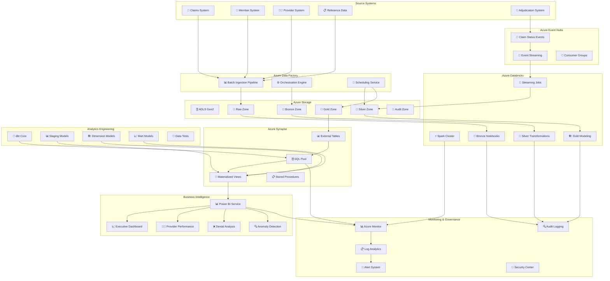

# ☁️ Azure Architecture Overview

## 🏗️ **Complete System Architecture**



## 🎯 **Architecture Components**

### 📥 **Ingestion Layer**
```
🔄 Azure Data Factory
├── 📊 Batch Ingestion (Daily files)
├── ⚙️ Pipeline Orchestration
├── 📅 Scheduling & Triggers
├── 🔍 Error Handling & Retries
└── 📋 Execution Monitoring

🌊 Azure Event Hubs
├── 📡 Real-time Event Streaming
├── 🔄 Multiple Consumer Groups
├── 📊 Event Partitioning
├── 🔍 Capture & Retention
└── ⚡ Low-Latency Processing
```

### 🗄️ **Storage Layer**
```
🗄️ Azure Data Lake Storage Gen2
├── 📁 Raw Zone (Source files as-is)
├── 📁 Bronze Zone (Validated raw data)
├── 📁 Silver Zone (Cleaned & enriched)
├── 📁 Gold Zone (Curated analytics)
├── 📁 Audit Zone (Logs & metrics)
└── 🔒 Hierarchical namespace
```

### ⚡ **Processing Layer**
```
⚡ Azure Databricks
├── 📊 Spark Cluster (Premium tier)
├── 📓 14 Production Notebooks
├── 🌊 Structured Streaming
├── 🏗️ Delta Lake ACID transactions
├── 🔍 Data Quality Framework
├── 📊 Performance Optimization
└── 🚀 Auto-scaling & Optimization
```

### 🗄️ **Serving Layer**
```
🗄️ Azure Synapse Analytics
├── 📊 SQL Pool (Dedicated)
├── 📋 External Tables (Point to ADLS)
├── 🚀 Materialized Views (Performance)
├── 📊 Stored Procedures (Business logic)
├── 🔍 Query Optimization
└── 👥 Role-based Security
```

### 🔧 **Analytics Layer**
```
🔧 dbt Analytics Engineering
├── 📊 Staging Models (Raw transformations)
├── 🏗️ Dimension Models (Conformed dimensions)
├── 📈 Mart Models (Business-focused)
├── 🧪 Data Tests (Quality validation)
├── 📚 Documentation (Auto-generated)
└── 🔄 CI/CD Integration
```

### 📊 **Presentation Layer**
```
📊 Power BI Service
├── 📈 Executive Overview Dashboard
├── 👨‍⚕️ Provider Performance Dashboard
├── ❌ Denial Analysis Dashboard
├── 🔍 Anomaly Detection Dashboard
├── 👥 Member Utilization Dashboard
├── 🔄 Scheduled Refresh
└── 👥 Role-based Access
```

### 🔍 **Monitoring Layer**
```
🔍 Azure Monitor & Log Analytics
├── 📊 Pipeline Performance Metrics
├── 🚨 Real-time Alerting
├── 📋 Log Aggregation & Analysis
├── 🔍 Custom Metrics & Dashboards
├── 📊 Cost Monitoring
└── 🔐 Security Monitoring
```

## 🚀 **Data Flow Architecture**

### 📊 **Batch Processing Flow**
```
1. 🏥 Source Systems → Daily CSV files
2. 📊 ADF Pipeline → Copy to ADLS Raw
3. ⚡ Databricks Bronze → Validate & enrich
4. 🔧 Databricks Silver → Clean & transform
5. 🏗️ Databricks Gold → Business modeling
6. 🗄️ Synapse → External tables & views
7. 📊 Power BI → Executive dashboards
```

### 🌊 **Streaming Processing Flow**
```
1. 🔄 Adjudication System → Claim status events
2. 📡 Event Hubs → Real-time event capture
3. ⚡ Structured Streaming → Process events
4. 🔧 CDC MERGE → Update Silver tables
5. 🏗️ Gold Refresh → Update analytics
6. 📊 Power BI → Near real-time dashboards
```

## 🔒 **Security Architecture**

### 🛡️ **Identity & Access Management**
```
🔐 Azure Active Directory
├── 👥 Role-based Access Control (RBAC)
├── 🔑 Managed Identities
├── 🔒 Conditional Access Policies
├── 📋 Azure AD Privileged Identity Management
└── 🔍 Multi-factor Authentication
```

### 🔒 **Data Protection**
```
🔒 Data Security
├── 🔐 Encryption at Rest (ADLS)
├── 🔐 Encryption in Transit (HTTPS/TLS)
├── 🛡️ Network Security Groups
├── 🔍 Azure Private Endpoints
├── 📋 Data Classification
└── 🔍 Data Loss Prevention
```

### 📋 **Compliance & Governance**
```
📋 Governance Framework
├── 📊 Data Lineage Tracking
├── 🔍 Audit Logging (All layers)
├── 📋 Data Quality Metrics
├── 🔍 Change Management
├── 📊 Cost Management
└── 🔍 Compliance Reporting
```

## 📈 **Performance Architecture**

### ⚡ **Scalability Design**
```
📈 Horizontal Scaling
├── ⚡ Auto-scaling Databricks clusters
├── 📊 Synapse SQL Pool scaling
├── 🌊 Event Hubs partitioning
├── 🗄️ ADLS infinite scalability
└── 📊 Load balancing across services
```

### 🚀 **Optimization Strategies**
```
🚀 Performance Optimization
├── 📊 Delta Lake Z-ordering
├── 🗄️ Synapse materialized views
├── 📊 Power BI caching
├── 🔍 Query optimization
├── 📊 Data partitioning
└── 🚀 Caching layers
```

## 💰 **Cost Architecture**

### 💸 **Cost Optimization**
```
💰 Cost Management
├── 📊 Reserved instances (Databricks)
├── 🗄️ Serverless where possible
├── 📊 Auto-pause/Resume (Synapse)
├── 🔍 Cost monitoring & alerts
├── 📊 Resource tagging
└── 🎯 Right-sizing recommendations
```

## 🎯 **Architecture Benefits**

### ✅ **Technical Benefits**
- **🏗️ Scalability**: Designed for high-volume claim processing
- **⚡ Performance**: Optimized for fast query response
- **🔒 Reliability**: Built for high availability
- **🌊 Flexibility**: Batch + streaming processing options
- **🔍 Observability**: Comprehensive monitoring capabilities

### 💼 **Business Benefits**
- **📈 Faster Insights**: Near real-time claim processing
- **💰 Cost Efficiency**: Optimized cloud resource utilization
- **🎯 Better Decisions**: Comprehensive analytics framework
- **🔒 Compliance**: Healthcare data governance practices
- **👥 User Adoption**: Self-service BI capabilities

---

## 🎯 **Why This Architecture Works**

This architecture demonstrates:
- **🏗️ Cloud Expertise**: Full Azure service integration
- **📊 Data Engineering**: End-to-end pipeline design
- **🌊 Modern Patterns**: Lakehouse + streaming
- **🔍 Production Thinking**: Monitoring & governance
- **💰 Business Focus**: Cost optimization & ROI


---

## 📋 **Technical Implementation**

**Key Technical Skills:**
- Azure service integration and orchestration
- Modern data lakehouse patterns with Delta Lake
- Real-time streaming with Event Hubs and Structured Streaming
- Analytics engineering with dbt and Synapse
- Production monitoring and governance practices
