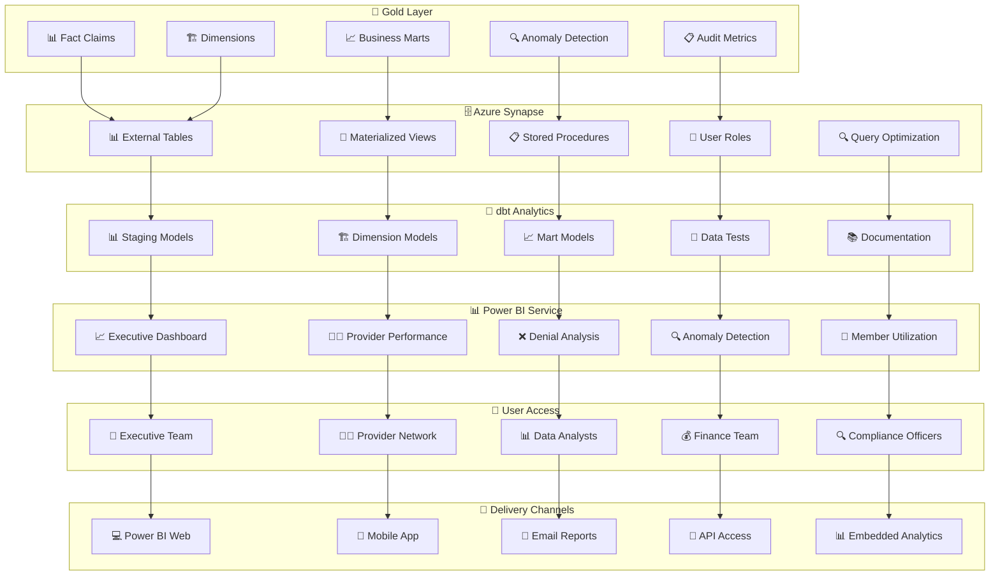

# 📊 Dashboard & Analytics Architecture

## 🎯 **Analytics Overview**

The Healthcare Claims Lakehouse provides comprehensive business intelligence through **Power BI dashboards** that deliver real-time insights to executives, providers, and analysts. The architecture supports self-service analytics while maintaining data governance and performance.



## 📊 **Dashboard Hierarchy**

### 🎯 **Executive Dashboard**
```
📈 Executive Overview Dashboard
├── 🎯 Primary KPIs
│   ├── Total Claims Processed
│   ├── Total Paid Amount
│   ├── Overall Denial Rate
│   ├── Active Providers
│   ├── Active Members
│   └── System Health Score
├── 📊 Trend Analysis
│   ├── Monthly Claim Volume
│   ├── Payment Processing Trends
│   ├── Denial Rate Movement
│   ├── Provider Growth
│   └── Cost Trends
├── 🗺️ Geographic Insights
│   ├── Claims by State Heat Map
│   ├── Regional Performance
│   ├── Provider Distribution
│   └── Member Demographics
└── 🚨 System Health
    ├── Data Freshness Indicators
    ├── Stream Status
    ├── Quality Metrics
    └── Alert Summary
```

### 👨‍⚕️ **Provider Performance Dashboard**
```
👨‍⚕️ Provider Performance Dashboard
├── 📊 Provider Search & Filter
│   ├── Provider Name Search
│   ├── Specialty Filter
│   ├── Geographic Filter
│   ├── Network Status Filter
│   └── Performance Range Filter
├── 📈 Individual Provider Metrics
│   ├── Claim Volume & Amount
│   ├── Denial Rate & Payment Rate
│   ├── Processing Delay Metrics
│   ├── Member Satisfaction
│   └── Quality Scores
├── 🏆 Performance Rankings
│   ├── Top 10 by Volume
│   ├── Top 10 by Revenue
│   ├── Best Payment Rates
│   ├── Lowest Denial Rates
│   └── Most Improved
├── 📊 Comparative Analysis
│   ├── Specialty Benchmarks
│   ├── Regional Comparisons
│   ├── Network vs Out-of-Network
│   └── Time Period Comparisons
└── 🔍 Quality Metrics
    ├── Radar Chart Analysis
    ├── Compliance Scores
    ├── Audit Findings
    └── Risk Assessment
```

### ❌ **Denial Analysis Dashboard**
```
❌ Denial Analysis Dashboard
├── 📊 Denial Overview
│   ├── Total Denied Claims
│   ├── Denial Rate Trend
│   ├── Denied Amount Impact
│   ├── Affected Providers
│   └── Affected Members
├── 🔍 Root Cause Analysis
│   ├── Top Denial Reasons
│   ├── Denial by Payer Type
│   ├── Denial by Specialty
│   ├── Denial by Geography
│   └── Denial by Procedure
├── 📈 Trend Analysis
│   ├── Monthly Denial Trends
│   ├── Payer-Specific Trends
│   ├── Specialty Trends
│   ├── Seasonal Patterns
│   └── Year-over-Year Comparison
├── 👨‍⚕️ Provider Analysis
│   ├── High Denial Rate Providers
│   ├── Provider Denial Patterns
│   ├── Specialty-Specific Issues
│   ├── Regional Denial Hotspots
│   └── Improvement Opportunities
└── 🚨 Alert System
    ├── Denial Rate Thresholds
    ├── Anomaly Detection
    ├── Trend Deviations
    │   └── Action Items
```

### 🔍 **Anomaly Detection Dashboard**
```
🔍 Anomaly Detection Dashboard
├── 📊 Anomaly Overview
│   ├── Total Anomalies Detected
│   ├── Anomaly Rate Trends
│   ├── Risk Level Distribution
│   ├── Investigation Queue
│   └── Resolution Metrics
├── 🔍 Anomaly Types
│   ├── Duplicate Claims
│   ├── Amount Outliers
│   ├── Suspicious Patterns
│   ├── High-Risk Providers
│   └── Unusual Member Behavior
├── 📈 Risk Assessment
│   ├── High-Risk Claims
│   ├── Provider Risk Scores
│   ├── Geographic Hotspots
│   ├── Specialty-Specific Risks
│   └── Temporal Patterns
├── 👥 Investigation Workflow
│   ├── New Anomalies Queue
│   ├── In Progress Investigations
│   ├── Resolved Cases
│   ├── Investigation History
│   └── Resolution Time Metrics
└── 📊 Pattern Analysis
    ├── Claim Frequency Analysis
    ├── Amount Distribution
    ├── Provider-Claim Patterns
    ├── Member-Claim Patterns
    └── Cross-Reference Analysis
```

### 👥 **Member Utilization Dashboard**
```
👥 Member Utilization Dashboard
├── 📊 Utilization Overview
│   ├── Active Members
│   ├── Claims Per Member
│   ├── Average Claim Amount
│   ├── High Utilization Members
│   └── Cost Distribution
├── 👥 Demographic Analysis
│   ├── Age Group Utilization
│   ├── Gender Distribution
│   ├── Geographic Distribution
│   ├── Plan Type Analysis
│   └── Eligibility Status
├── 📈 Utilization Patterns
│   ├── Service Type Utilization
│   ├── Seasonal Patterns
│   ├── Provider Preferences
│   ├── Geographic Preferences
│   └── Cost Drivers
├── 🎯 High-Cost Members
│   ├── Top Cost Members
│   ├── Utilization Patterns
│   ├── Provider Relationships
│   ├── Service Patterns
│   └── Intervention Opportunities
└── 📊 Predictive Analytics
    ├── Utilization Forecasts
    ├── Cost Projections
    ├── Risk Scoring
    ├── Intervention Recommendations
    └── Trend Analysis
```

## 🗄️ **Synapse Analytics Layer**

### 📊 **External Tables Setup**
```sql
-- External Tables for Power BI
CREATE EXTERNAL TABLE analytics.fct_claims
WITH (
    LOCATION = '/gold/fact_claims',
    DATA_SOURCE = [adls_gold_lakehouse],
    FILE_FORMAT = [delta_format]
);

CREATE EXTERNAL TABLE analytics.dim_member
WITH (
    LOCATION = '/gold/dim_member',
    DATA_SOURCE = [adls_gold_lakehouse],
    FILE_FORMAT = [delta_format]
);

-- Additional dimension and mart tables...
```

### 🚀 **Materialized Views**
```sql
-- Performance-Optimized Views
CREATE MATERIALIZED VIEW analytics.mv_provider_monthly_performance
WITH (DISTRIBUTION = HASH(provider_id))
AS
SELECT 
    provider_id,
    provider_specialty_category,
    service_year,
    service_month,
    COUNT(*) as total_claims,
    SUM(total_claim_amount) as total_amount,
    AVG(total_claim_amount) as avg_amount,
    AVG(denial_rate) as avg_denial_rate
FROM analytics.mart_provider_performance
GROUP BY provider_id, provider_specialty_category, service_year, service_month;

CREATE MATERIALIZED VIEW analytics.mv_denial_monthly_trends
WITH (DISTRIBUTION = HASH(payer_type))
AS
SELECT 
    service_year,
    service_month,
    payer_type,
    provider_specialty_category,
    SUM(denied_claims_count) as total_denied,
    AVG(denial_count_rate) as avg_denial_rate
FROM analytics.mart_denial_trends
GROUP BY service_year, service_month, payer_type, provider_specialty_category;
```

### 📋 **Stored Procedures**
```sql
-- Business Logic Procedures
CREATE PROCEDURE analytics.sp_provider_performance_summary
    @provider_id VARCHAR(50),
    @year INT,
    @quarter INT
AS
BEGIN
    SELECT 
        provider_id,
        provider_name,
        provider_specialty_category,
        service_year,
        service_quarter,
        total_claims,
        total_claim_amount,
        avg_claim_amount,
        denial_rate,
        paid_rate,
        unique_members,
        specialty_rank_quarter
    FROM analytics.mart_provider_performance
    WHERE provider_id = @provider_id
        AND service_year = @year
        AND service_quarter = @quarter;
END;

CREATE PROCEDURE analytics.sp_denial_analysis_by_payer
    @payer_type VARCHAR(50),
    @start_date DATE,
    @end_date DATE
AS
BEGIN
    SELECT 
        service_year,
        service_quarter,
        payer_type,
        provider_specialty_category,
        denied_claims_count,
        denied_amount,
        denial_count_rate,
        qoq_denial_count_growth
    FROM analytics.mart_denial_trends
    WHERE payer_type = @payer_type
        AND denial_date BETWEEN @start_date AND @end_date
    ORDER BY service_year, service_quarter;
END;
```

## 🔧 **dbt Analytics Engineering**

### 📊 **Model Hierarchy**
```
🔧 dbt Model Structure
├── 📊 Staging Models
│   ├── stg_claims.sql (Raw claims transformation)
│   ├── stg_members.sql (Raw member transformation)
│   ├── stg_providers.sql (Raw provider transformation)
│   └── stg_reference_data.sql (Reference data)
├── 🏗️ Dimension Models
│   ├── dim_member.sql (Member dimension with SCD)
│   ├── dim_provider.sql (Provider dimension with SCD)
│   ├── dim_diagnosis.sql (Diagnosis dimension)
│   ├── dim_procedure.sql (Procedure dimension)
│   └── dim_date.sql (Date dimension)
├── 📈 Mart Models
│   ├── mart_provider_performance.sql (Provider analytics)
│   ├── mart_denial_trends.sql (Denial analytics)
│   ├── mart_member_utilization.sql (Member analytics)
│   └── mart_claim_anomalies.sql (Anomaly analytics)
└── 🧪 Tests & Documentation
    ├── Schema tests (not null, uniqueness)
    ├── Data tests (business rules)
    ├── Documentation (auto-generated)
    └── Lineage tracking
```

### 🧪 **Data Testing**
```sql
-- dbt Tests Example
-- tests/assert_not_null_claims.sql
SELECT * FROM {{ ref('stg_claims') }}
WHERE claim_id IS NULL
    OR member_id IS NULL
    OR provider_id IS NULL
    OR claim_amount IS NULL;

-- tests/assert_unique_claim_lines.sql
SELECT claim_line_id, COUNT(*) 
FROM {{ ref('stg_claims') }}
GROUP BY claim_line_id
HAVING COUNT(*) > 1;

-- tests/assert_positive_amounts.sql
SELECT * FROM {{ ref('stg_claims') }}
WHERE claim_amount < 0;
```

## 📊 **Power BI Data Modeling**

### 🔗 **Relationship Model**
```
📊 Power BI Data Model
├── 📈 Fact Table (Central)
│   └── fact_claims (grain: claim line)
├── 🏗️ Dimension Tables (Related)
│   ├── dim_member (many-to-one)
│   ├── dim_provider (many-to-one)
│   ├── dim_diagnosis (many-to-one)
│   ├── dim_procedure (many-to-one)
│   ├── dim_payer (many-to-one)
│   └── dim_date (many-to-one)
├── 📊 Role Playing Dimensions
│   ├── service_date (claim date)
│   ├── submission_date (processing date)
│   └── payment_date (settlement date)
└── 🔍 Calculations
    ├── DAX measures for KPIs
    ├── Time intelligence calculations
    ├── Ranking and percentiles
    └── Dynamic aggregations
```

### 📈 **DAX Measures**
```dax
-- Key Performance Indicators
Total Claims = COUNTROWS(fact_claims)
Total Paid Amount = SUM(fact_claims[paid_amount])
Denial Rate = DIVIDE(COUNTROWS(FILTER(fact_claims, fact_claims[claim_status] = "DENIED")), Total Claims)
Payment Rate = DIVIDE([Total Paid Amount], SUM(fact_claims[claim_amount]))

-- Time Intelligence
Claims YTD = TOTALYTD([Total Claims], dim_date[date])
Claims YoY Growth = DIVIDE([Total Claims] - CALCULATE([Total Claims], SAMEPERIODLASTYEAR(dim_date[date])), CALCULATE([Total Claims], SAMEPERIODLASTYEAR(dim_date[date])))

-- Provider Rankings
Provider Rank = RANKX(ALL(dim_provider[provider_id]), [Total Claims],, DESC, Dense)
Provider Percentile = DIVIDE(RANKX(ALL(dim_provider[provider_id]), [Total Claims],, ASC, Dense) - 1, COUNTROWS(ALL(dim_provider[provider_id])))
```

## 👥 **User Access & Security**

### 🔐 **Role-Based Access**
```
👥 Security Roles
├── 👔 Executive Team
│   ├── Executive Dashboard access
│   ├── KPI visibility
│   ├── Trend analysis
│   └── Geographic insights
├── 👨‍⚕️ Provider Network
│   ├── Provider performance dashboard
│   ├── Individual provider metrics
│   ├── Specialty benchmarks
│   └── Quality metrics
├── 📊 Data Analysts
│   ├── Full dashboard access
│   ├── Drill-through capabilities
│   ├── Custom report building
│   └── Data export permissions
├── 💰 Finance Team
│   ├── Financial metrics
│   ├── Cost analysis
│   ├── Payment trends
│   └── Revenue analytics
└── 🔍 Compliance Officers
    ├── Audit trail access
    ├── Quality metrics
    ├── Anomaly detection
    └── Compliance reports
```

### 🔒 **Data Security**
```
🔒 Security Measures
├── 🔐 Authentication: Azure AD integration
├── 👥 Authorization: Role-based permissions
├── 🔒 Data Masking: Sensitive field protection
├── 📊 Row-Level Security: User-specific data
├── 🔍 Audit Logging: All user activities
├── 🚨 Conditional Access: Location/device policies
├── 📋 Data Classification: Sensitivity labels
└── 🔍 Compliance: HIPAA requirements
```

## 📱 **Delivery & Distribution**

### 📊 **Power BI Service Features**
```
📊 Service Capabilities
├── 🌐 Web Access: Browser-based dashboards
├── 📱 Mobile App: iOS/Android applications
├── 📧 Email Subscriptions: Automated reports
├── 🔗 API Access: Programmatic access
├── 📊 Embedded Analytics: Integration options
├── 👥 Workspaces: Collaborative environments
├── 🔄 Scheduled Refresh: Automated updates
├── 📊 Version History: Change tracking
├── 🔍 Usage Metrics: Adoption tracking
└── 🚨 Alerts: Data-driven notifications
```

### 🔄 **Refresh Strategy**
```
🔄 Data Freshness
├── ⚡ Real-time: Streaming updates for immediate insights
├── 📊 Near Real-time: Micro-batch processing for frequent updates
├── 📅 Scheduled: Daily full refresh for complete data
├── 📊 Incremental: Hourly updates for efficiency
├── 🔍 Validation: Post-refresh data quality checks
├── 🚨 Notifications: Automated refresh failure alerts
├── 📊 Performance: Refresh optimization strategies
└── 📋 Monitoring: Comprehensive refresh health tracking
```

## 📈 **Performance Optimization**

### ⚡ **Query Optimization**
```
⚡ Performance Strategies
├── 🗄️ Materialized Views: Pre-aggregated data
├── 📊 Partitioning: Date-based partitioning
├── 🔍 Indexing: Strategic index creation
├── 🚀 Caching: Result set caching
├── 📊 Connection Pooling: Efficient connections
├── 🔍 Query Optimization: DAX best practices
├── 📊 Data Modeling: Star schema design
└── 🚀 Compression: Storage optimization
```

### 📊 **Dashboard Performance**
```
📊 User Experience
├── ⚡ Load Time: Optimized for fast initial loading
├── 🔄 Interaction: Responsive user interactions
├── 📊 Data Volume: Designed for large dataset handling
├── 🎨 Visual Optimization: Efficient visual components
├── 🔍 Filter Performance: Optimized slicer performance
├── 📱 Mobile Performance: Responsive mobile design
├── 🌐 Network: Optimized for network distribution
└── 🚀 Scalability: Built for concurrent user access
```

---

## 🎯 **Why Dashboard Architecture Matters**

This analytics implementation demonstrates:
- **📊 Business Intelligence**: Executive-level dashboard design
- **🔧 Technical Depth**: Synapse, dbt, Power BI integration
- **👥 User Experience**: Role-based access and security
- **📈 Performance**: Optimized for scale and speed
- **💼 Business Value**: Real-time insights and decision support

Perfect for showcasing **full-stack data engineering and analytics capabilities**! 🚀
