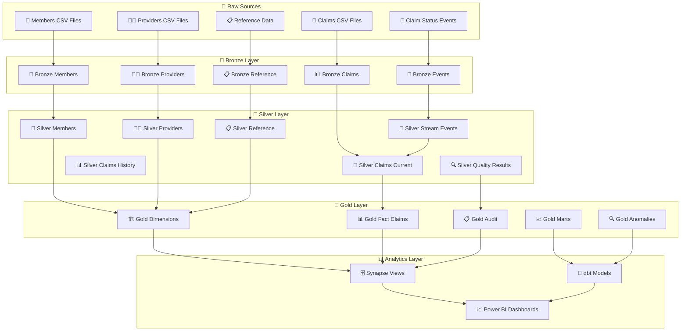

# 🏗️ Medallion Architecture Model

## 🎯 **Medallion Architecture Overview**

The Healthcare Claims Lakehouse uses the **Medallion Architecture** pattern to progressively refine and structure data from raw source to curated analytics. This approach ensures data quality, performance, and business value at each layer.



## 🥉 **Bronze Layer - Raw Data Ingestion**

### 🎯 **Purpose**
- **📁 Preserve Source**: Keep raw data exactly as received
- **🔍 Validation**: Basic schema and format validation
- **📋 Metadata**: Add ingestion timestamps and lineage
- **🔒 Immutable**: Never modify original source data

### 📊 **Bronze Tables**
```
🥉 Bronze Layer Tables
├── 📊 bronze_claims
│   ├── claim_id, member_id, provider_id
│   ├── claim_amount, claim_status
│   ├── service_date, submission_date
│   └── ingestion_metadata
├── 👥 bronze_members
│   ├── member_id, demographics
│   ├── eligibility information
│   └── ingestion_metadata
├── 👨‍⚕️ bronze_providers
│   ├── provider_id, credentials
│   ├── specialty, network status
│   └── ingestion_metadata
├── 📋 bronze_reference
│   ├── diagnosis codes
│   ├── procedure codes
│   ├── payer information
│   └── ingestion_metadata
└── 🌊 bronze_claim_status_events
    ├── event_id, claim_id
    ├── status changes, timestamps
    └── streaming_metadata
```

### 🔍 **Bronze Layer Characteristics**
```
🔍 Bronze Layer Properties
├── 📁 Format: Delta Lake (for reliability)
├── 🔒 Immutable: Append-only operations
├── 📋 Metadata: Pipeline run IDs, timestamps
├── 🔍 Validation: Schema enforcement, null checks
├── 📊 Partitioning: By ingestion date
├── 🚀 Performance: Optimized for full scans
└── 💾 Retention: Long-term archival
```

## 🥈 **Silver Layer - Business Logic & Transformation**

### 🎯 **Purpose**
- **🔧 Clean**: Fix data quality issues
- **📊 Standardize**: Apply business rules and standards
- **🔍 Enrich**: Join with reference data
- **📈 Optimize**: Structure for performance

### 📊 **Silver Tables**
```
🥈 Silver Layer Tables
├── 🔧 silver_claims_current
│   ├── Cleaned claim data
│   ├── Validated amounts and dates
│   ├── Enriched with reference data
│   ├── Current claim status
│   └── Quality metrics
├── 📊 silver_claims_history
│   ├── Historical claim changes
│   ├── Status change tracking
│   ├── Audit trail
│   └── Temporal versioning
├── 👥 silver_members
│   ├── Validated member data
│   ├── Standardized demographics
│   ├── Eligibility validation
│   └── Current member status
├── 👨‍⚕️ silver_providers
│   ├── Cleaned provider information
│   ├── Specialty standardization
│   ├── Network validation
│   └── Current provider status
├── 📋 silver_reference
│   ├── Cleaned reference data
│   ├── Standardized codes
│   ├── Validated hierarchies
│   └── Current reference data
└── 🔍 silver_data_quality
    ├── Quality validation results
    ├── Quarantine records
    ├── Error tracking
    └── Quality metrics
```

### 🔧 **Silver Layer Transformations**
```
🔧 Transformation Logic
├── 🧹 Data Cleaning
│   ├── Remove duplicates
│   ├── Fix formatting issues
│   ├── Standardize null values
│   └── Validate data ranges
├── 📊 Business Rules
│   ├── Apply claim validation rules
│   ├── Enforce business constraints
│   ├── Calculate derived fields
│   └── Apply regulatory rules
├── 🔍 Data Enrichment
│   ├── Join with reference data
│   ├── Add geographic data
│   ├── Calculate time-based fields
│   └── Apply categorization
├── 📈 Quality Assurance
│   ├── Run 50+ validation rules
│   ├── Quarantine bad records
│   ├── Track quality metrics
│   └── Generate quality reports
└── 🚀 Performance Optimization
    ├── Optimize data types
    ├── Apply partitioning
    ├── Create indexes
    └── Cache frequently used data
```

## 🥇 **Gold Layer - Analytics Ready**

### 🎯 **Purpose**
- **📊 Business-Focused**: Optimized for analytics
- **🏗️ Structured**: Dimensional modeling patterns
- **📈 Performance**: Sub-second query response
- **👥 User-Friendly**: Easy to understand and query

### 📊 **Gold Tables**
```
🥇 Gold Layer Tables
├── 🏗️ Gold Dimensions
│   ├── dim_member (SCD Type 2)
│   ├── dim_provider (SCD Type 2)
│   ├── dim_diagnosis
│   ├── dim_procedure
│   ├── dim_payer
│   └── dim_date
├── 📊 Gold Fact Tables
│   ├── fact_claims (grain: claim line)
│   ├── fact_claim_status_changes
│   └── fact_quality_metrics
├── 📈 Gold Marts
│   ├── mart_provider_performance
│   ├── mart_denial_trends
│   ├── mart_member_utilization
│   └── mart_claim_anomalies
└── 🔍 Gold Analytics
    ├── anomaly_detection_results
    ├── performance_metrics
    ├── audit_summary
    └── system_health
```

### 🏗️ **Gold Layer Modeling**
```
🏗️ Dimensional Modeling
├── 📊 Conformed Dimensions
│   ├── Consistent across all facts
│   ├── SCD Type 2 for slowly changing
│   ├── Business-friendly names
│   └── Hierarchical relationships
├── 📈 Fact Tables
│   ├── Atomic grain (claim line level)
│   ├── Degenerate dimensions
│   ├── Calculated measures
│   └── Performance optimized
├── 📊 Business Marts
│   ├── Department-specific views
│   ├── Pre-aggregated metrics
│   ├── Business logic applied
│   └── Performance tuned
└── 🔍 Analytics Ready
    ├── Surrogate keys
    ├── Optimized data types
    ├── Proper partitioning
    └── Query-friendly structure
```

## 🔄 **Data Flow Between Layers**

### 📊 **Batch Processing Flow**
```
🔄 Daily Batch Flow
1. 🏥 Source Files → Bronze
   ├── Load raw files unchanged
   ├── Add ingestion metadata
   ├── Validate basic schema
   └── Store in Delta format

2. 🥉 Bronze → Silver
   ├── Clean and validate data
   ├── Apply business rules
   ├── Enrich with reference data
   ├── Handle data quality issues
   └── Create current + historical views

3. 🥈 Silver → Gold
   ├── Build dimensional models
   ├── Create fact tables
   ├── Generate business marts
   ├── Apply performance optimizations
   └── Prepare for analytics
```

### 🌊 **Streaming Processing Flow**
```
🌊 Real-time Flow
1. 🔄 Event Source → Bronze Events
   ├── Capture real-time events
   ├── Add streaming metadata
   ├── Validate event schema
   └── Store with watermarking

2. 🥉 Bronze Events → Silver
   ├── Process events in micro-batches
   ├── Apply CDC logic
   ├── Update current tables
   ├── Maintain history
   └── Handle late-arriving data

3. 🥈 Silver → Gold (Incremental)
   ├── Update dimensional models
   ├── Refresh fact tables
   ├── Recalculate marts
   ├── Update dashboards
   └── Refresh analytics
```

## 📈 **Quality & Governance**

### 🔍 **Data Quality Framework**
```
🔍 Quality by Layer
├── 🥉 Bronze: Basic validation
│   ├── Schema compliance
│   ├── Format validation
│   ├── Null value checks
│   └── Duplicate detection
├── 🥈 Silver: Business validation
│   ├── Business rule enforcement
│   ├── Referential integrity
│   ├── Range validation
│   └── Consistency checks
├── 🥇 Gold: Analytics validation
│   ├── Dimensional integrity
│   ├── Fact completeness
│   ├── Performance validation
│   └── User acceptance testing
└── 📊 Quality Metrics
    ├── Pass rates by layer
    ├── Error tracking
    ├── Trend analysis
    └── Improvement recommendations
```

### 📋 **Data Governance**
```
📋 Governance Framework
├── 🔍 Data Lineage
│   ├── End-to-end tracking
│   ├── Source to target mapping
│   ├── Transformation logging
│   └── Impact analysis
├── 📊 Data Catalog
│   ├── Business glossary
│   ├── Technical metadata
│   ├── Quality metrics
│   └── Usage statistics
├── 🔒 Access Control
│   ├── Role-based permissions
│   ├── Data masking
│   ├── Audit logging
│   └── Compliance tracking
└── 📈 Performance Monitoring
    ├── Query performance
    ├── Processing times
    ├── Cost tracking
    └── Optimization alerts
```

## 🚀 **Performance Optimization**

### ⚡ **Layer-Specific Optimizations**
```
⚡ Performance by Layer
├── 🥉 Bronze Optimizations
│   ├── Partition by ingestion date
│   ├── Compress for storage efficiency
│   ├── Optimize for full scans
│   └── Long-term retention strategy
├── 🥈 Silver Optimizations
│   ├── Partition by business keys
│   ├── Create appropriate indexes
│   ├── Optimize join strategies
│   └── Cache reference data
├── 🥇 Gold Optimizations
│   ├── Star schema optimization
│   ├── Materialized views
│   ├── Query result caching
│   └── Pre-aggregated marts
└── 📊 Cross-Layer Optimizations
    ├── Delta Lake optimizations
    ├── Z-ordering strategies
    ├── Auto-compaction
    └── Caching layers
```

## 🎯 **Benefits of Medallion Architecture**

### ✅ **Technical Benefits**
- **🔍 Data Quality**: Progressive validation and refinement
- **📊 Performance**: Optimized for different use cases
- **🔒 Reliability**: Immutable raw data + reliable transformations
- **🚀 Scalability**: Layer-specific scaling strategies
- **🔍 Observability**: Clear data lineage and monitoring

### 💼 **Business Benefits**
- **📈 Trust**: High-quality, reliable data
- **⚡ Speed**: Fast access to curated analytics
- **🎯 Flexibility**: Multiple consumption patterns
- **🔒 Compliance**: Clear governance and audit trail
- **💰 Efficiency**: Reduced data preparation time

---

## 🎯 **Why Medallion Architecture Works**

This approach demonstrates:
- **🏗️ Data Engineering Maturity**: Structured, scalable design
- **🔍 Quality Focus**: Multi-layer validation framework
- **📊 Business Alignment**: Analytics-ready data structures
- **🚀 Production Thinking**: Performance and governance
- **💼 Domain Expertise**: Healthcare-specific patterns

Perfect for showcasing **enterprise-level data architecture skills**! 🚀
