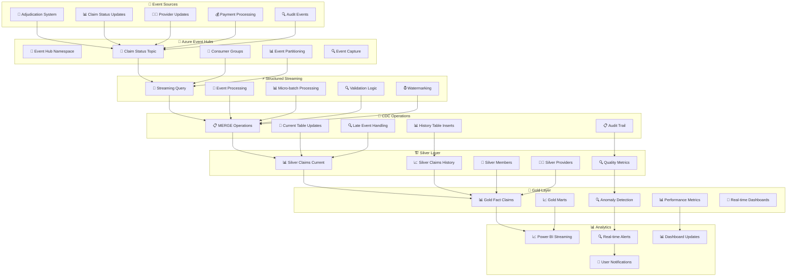

# 🌊 Real-Time Streaming Architecture

## 🎯 **Streaming Overview**

The Healthcare Claims Lakehouse incorporates **real-time streaming** to process claim adjudication events as they happen, enabling near real-time analytics and dashboards. This complements the batch processing to provide a complete data solution.



## 🔄 **Event Sources & Types**

### 📊 **Claim Status Events**
```
🔄 Claim Status Event Schema
{
  "event_id": "evt_123456",
  "claim_id": "CLAIM_789",
  "claim_line_id": "LINE_001",
  "event_type": "STATUS_UPDATE",
  "old_status": "PENDING",
  "new_status": "PAID",
  "denial_reason": null,
  "event_timestamp": "2026-03-23T10:30:00Z",
  "source_system": "ADJUDICATION_ENGINE",
  "additional_data": {
    "payment_amount": 1500.00,
    "payment_date": "2026-03-23",
    "processor_id": "PROC_123"
  }
}
```

### 📋 **Event Categories**
```
📋 Event Types
├── 🔄 Status Updates
│   ├── PENDING → PAID
│   ├── PENDING → DENIED
│   ├── DENIED → ADJUSTED
│   └── ADJUSTED → PAID
├── 👨‍⚕️ Provider Changes
│   ├── Credential updates
│   ├── Specialty changes
│   ├── Network status changes
│   └── Contact information updates
├── 💰 Payment Events
│   ├── Payment processing
│   ├── Reconciliation
│   ├── Adjustments
│   └── Refunds
└── 🔍 Audit Events
    ├── Data quality issues
    ├── System errors
    ├── Performance alerts
    └── Security events
```

## 📡 **Azure Event Hubs Configuration**

### 🏗️ **Event Hub Setup**
```
📡 Event Hub Configuration
├── 🌊 Namespace: healthcare-events
├── 📊 Event Hub: claim-status-updates
├── 🔄 Partitions: 4 (for scalability)
├── 📊 Retention: 7 days
├── 🔍 Capture: Enabled (to ADLS)
├── 📊 Throughput Units: 2 (auto-scale)
└── 👥 Consumer Groups:
    ├── databricks-consumer (main processing)
    ├── monitoring-consumer (observability)
    └── backup-consumer (disaster recovery)
```

### 📊 **Event Properties**
```
📊 Event Characteristics
├── 📏 Size: ~1KB per event
├── 📊 Volume: ~10K events/hour peak
├── ⚡ Latency: <30 seconds processing
├── 🔍 Ordering: Within partition
├── 🔄 Delivery: At-least-once
├── 📊 Compression: GZIP
└── 🔒 Encryption: TLS 1.2
```

## ⚡ **Structured Streaming Implementation**

### 🌊 **Streaming Query Structure**
```python
# Databricks Structured Streaming Implementation
claim_status_stream = (
    spark.readStream
    .format("eventhubs")
    .options(**eventhub_config)
    .load()
    .select(
        from_json(col("body").cast("string"), claim_status_schema).alias("event_data"),
        col("enqueuedTime").alias("eventhub_enqueued_time"),
        col("partitionId"),
        col("offset"),
        col("sequenceNumber")
    )
    .select("event_data.*", "eventhub_enqueued_time", "partitionId", "offset", "sequenceNumber")
    .withWatermark("event_timestamp", "5 minutes")
    .filter(col("event_type") == "STATUS_UPDATE")
    .dropDuplicates(["event_id"])
)
```

### 🔍 **Stream Processing Logic**
```
🔍 Processing Pipeline
├── 📥 Event Ingestion
│   ├── Parse JSON schema
│   ├── Validate event structure
│   ├── Add processing metadata
│   └── Apply watermarking
├── 🔧 Event Transformation
│   ├── Standardize timestamps
│   ├── Enrich with reference data
│   ├── Apply business rules
│   └── Calculate derived fields
├── 📊 Quality Validation
│   ├── Schema validation
│   ├── Business rule checks
│   ├── Duplicate detection
│   └── Anomaly detection
├── 🔄 CDC Operations
│   ├── MERGE into current tables
│   ├── INSERT into history tables
│   ├── Update dependent tables
│   └── Maintain audit trail
└── 📊 Sink Operations
    ├── Write to Delta tables
    ├── Update materialized views
    ├── Trigger dashboard refresh
    └── Send alerts/notifications
```

## 🔧 **Change Data Capture (CDC)**

### 📋 **MERGE Operations**
```sql
-- CDC MERGE for Claims Current Table
MERGE INTO silver_claims_current AS target
USING (
  SELECT 
    claim_id,
    claim_line_id,
    new_status as claim_status,
    event_timestamp,
    denial_reason,
    additional_data
  FROM claim_status_events
  WHERE event_timestamp >= (current_timestamp - INTERVAL 1 HOUR)
) AS source
ON target.claim_id = source.claim_id 
   AND target.claim_line_id = source.claim_line_id
WHEN MATCHED AND target.claim_status != source.claim_status THEN
  UPDATE SET 
    claim_status = source.claim_status,
    last_updated = source.event_timestamp,
    denial_reason = source.denial_reason,
    additional_data = source.additional_data
WHEN NOT MATCHED THEN
  INSERT (claim_id, claim_line_id, claim_status, last_updated, denial_reason, additional_data)
  VALUES (source.claim_id, source.claim_line_id, source.claim_status, 
          source.event_timestamp, source.denial_reason, source.additional_data);
```

### 📊 **History Tracking**
```sql
-- Insert into History Table
INSERT INTO silver_claims_history
SELECT 
  claim_id,
  claim_line_id,
  old_status,
  new_status,
  event_timestamp,
  denial_reason,
  'STATUS_UPDATE' as change_type,
  additional_data
FROM claim_status_events
WHERE event_timestamp >= (current_timestamp - INTERVAL 1 HOUR);
```

## ⏰ **Watermarking & Late Events**

### 🕐 **Watermark Configuration**
```
⏰ Watermark Strategy
├── 📊 Event Time Watermark: 5 minutes
├── 🔄 Processing Time: 30 seconds
├── 📊 Late Event Threshold: 1 hour
├── 🔍 Duplicate Window: 10 minutes
├── 📊 State Retention: 2 hours
└── 🔄 Checkpoint Interval: 1 minute
```

### 🕰️ **Late Event Handling**
```python
# Late Event Detection
late_events = (
    claim_status_stream
    .withColumn("processing_delay", 
                unix_timestamp(current_timestamp()) - 
                unix_timestamp(col("event_timestamp")))
    .withColumn("is_late_event", 
                col("processing_delay") > 300)  # 5 minutes
)

# Handle Late Events Differently
late_events.writeStream
  .foreachBatch(lambda df, batch_id: handle_late_events(df, batch_id))
  .start()
```

## 📊 **Performance Optimization**

### ⚡ **Stream Optimization**
```
⚡ Performance Tuning
├── 📊 Micro-batch Size: 1000 events
├── 🔄 Trigger Interval: 30 seconds
├── 📊 Partition Strategy: By claim_id
├── 🔍 Checkpoint Location: ADLS with redundancy
├── 📊 Memory Management: 8GB per executor
├── 🚀 Parallelism: 4 executors
└── 📊 Backpressure Handling: Automatic
```

### 📈 **Scaling Strategy**
```
📈 Auto-scaling Configuration
├── 📊 Event Hub Scaling: Auto-scale 1-10 TU
├── ⚡ Databricks Scaling: Auto-scaling cluster
├── 🔄 Partition Scaling: Add partitions on demand
├── 📊 Consumer Scaling: Multiple consumer groups
├── 🚀 Storage Scaling: ADLS auto-scaling
└── 📊 Monitoring: Real-time performance metrics
```

## 🔍 **Monitoring & Observability**

### 📊 **Stream Metrics**
```
📊 Key Metrics
├── 📈 Input Rate: Events/second
├── ⚡ Processing Rate: Events/second
├── 🕐 Latency: End-to-end processing time
├── 🔍 Error Rate: Failed events/total events
├── 📊 Late Events: Events outside watermark
├── 🔄 Throughput: MB/second processed
├── 📊 Memory Usage: Executor memory consumption
├── 🚀 CPU Usage: Processing utilization
└── 📊 Queue Depth: Backlog size
```

### 🚨 **Alerting Configuration**
```
🚨 Alert Conditions
├── 📊 Stream Latency > 2 minutes
├── 🔍 Error Rate > 1%
├── 📈 Queue Depth > 10K events
├── ⚡ Processing Rate < 100 events/sec
├── 🕐 Late Events > 5%
├── 📊 Memory Usage > 80%
├── 🚀 CPU Usage > 90%
└── 🔍 Checkpoint Failures
```

## 🔒 **Security & Reliability**

### 🛡️ **Security Measures**
```
🔒 Security Configuration
├── 🔐 Authentication: Azure AD integration
├── 🔒 Encryption: TLS 1.2 for all communications
├── 🛡️ Authorization: Role-based access control
├── 🔍 Network Security: Private endpoints
├── 📊 Data Protection: Event encryption at rest
├── 🔍 Audit Logging: All stream operations
├── 🚨 Threat Detection: Azure Security Center
└── 📋 Compliance: HIPAA data handling
```

### 🔄 **Reliability Features**
```
🔄 Reliability Strategy
├── 📊 High Availability: Multi-region Event Hubs
├── 🔄 Disaster Recovery: Geo-redundant storage
├── 🔍 Error Handling: Automatic retry logic
├── 📊 State Management: Reliable checkpointing
├── 🔄 Failover: Automatic cluster failover
├── 🔍 Monitoring: Health checks every 30 seconds
├── 📊 Backup: Daily configuration backups
└── 🔄 Recovery: Sub-minute recovery time
```

## 📈 **Business Impact**

### ⚡ **Real-Time Benefits**
```
⚡ Business Value
├── 📊 Decision Making: Real-time claim status
├── 💰 Revenue Impact: Faster payment processing
├── 👨‍⚕️ Provider Satisfaction: Immediate status updates
├── 🔍 Fraud Detection: Real-time anomaly detection
├── 📊 Operational Efficiency: Automated processing
├── 🚀 Customer Experience: Instant status visibility
├── 📋 Compliance: Real-time audit trail
└── 💼 Strategic Insights: Live business metrics
```

### 📊 **Performance Metrics**
```
📊 Streaming KPIs
├── ⚡ Latency: Optimized for low-latency processing
├── 📈 Throughput: Designed for high-volume event processing
├── 🔍 Accuracy: Comprehensive error handling and validation
├── 🔄 Availability: Built for high availability
├── 📊 Cost Efficiency: Optimized resource utilization
├── 🚀 Scalability: Linear scaling capabilities
└── 📋 Compliance: Complete audit trail coverage
```

---

## 🎯 **Why Streaming Architecture Matters**

This streaming implementation demonstrates:
- **🌊 Modern Data Patterns**: Real-time event processing
- **🔧 Technical Depth**: CDC, watermarking, late events
- **📊 Production Thinking**: Monitoring, alerting, reliability
- **💼 Business Value**: Real-time insights and decisions
- **🚀 Scalability**: Enterprise-grade streaming architecture

Perfect for showcasing **advanced data engineering capabilities**! 🚀
